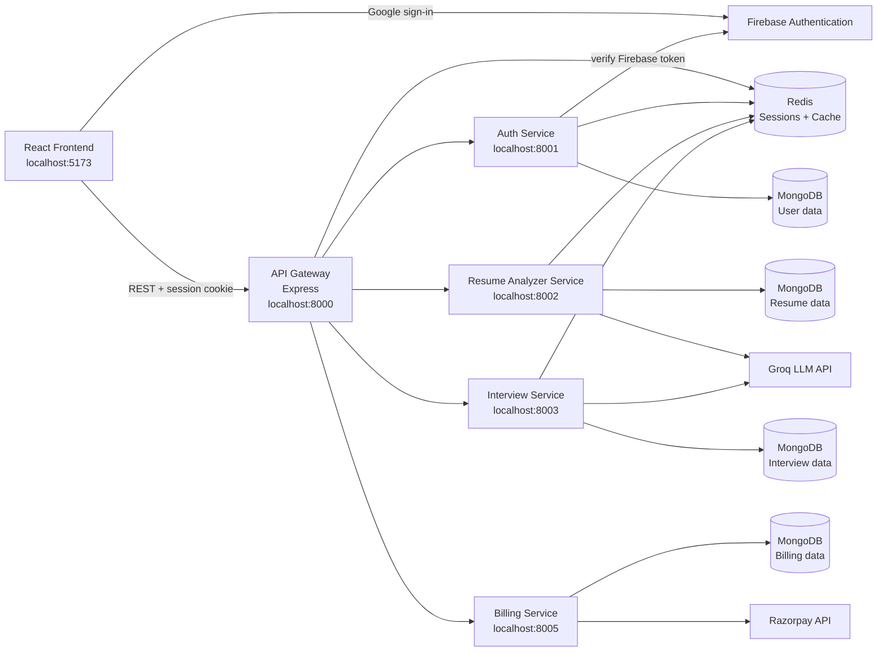
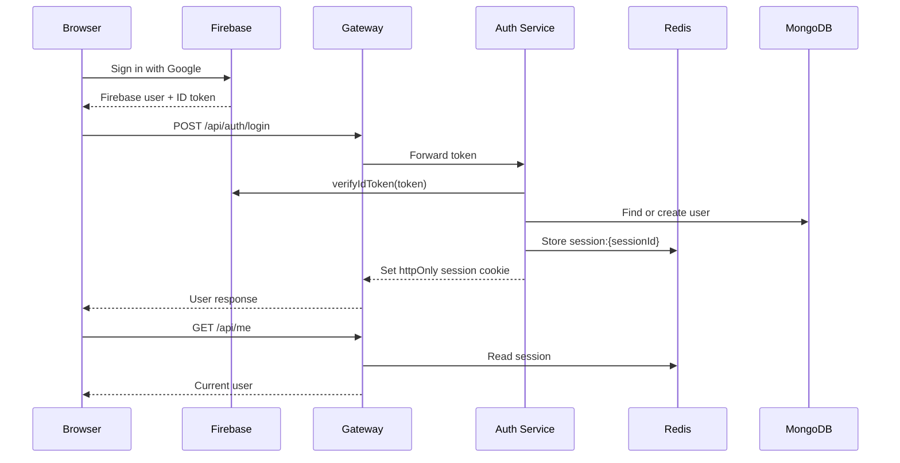
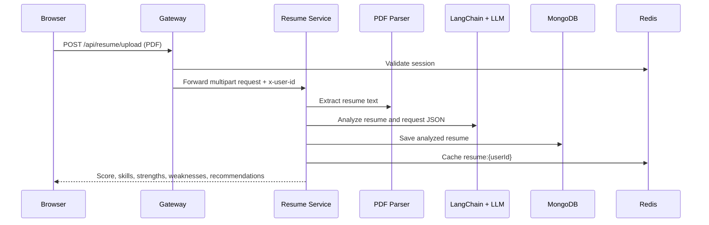
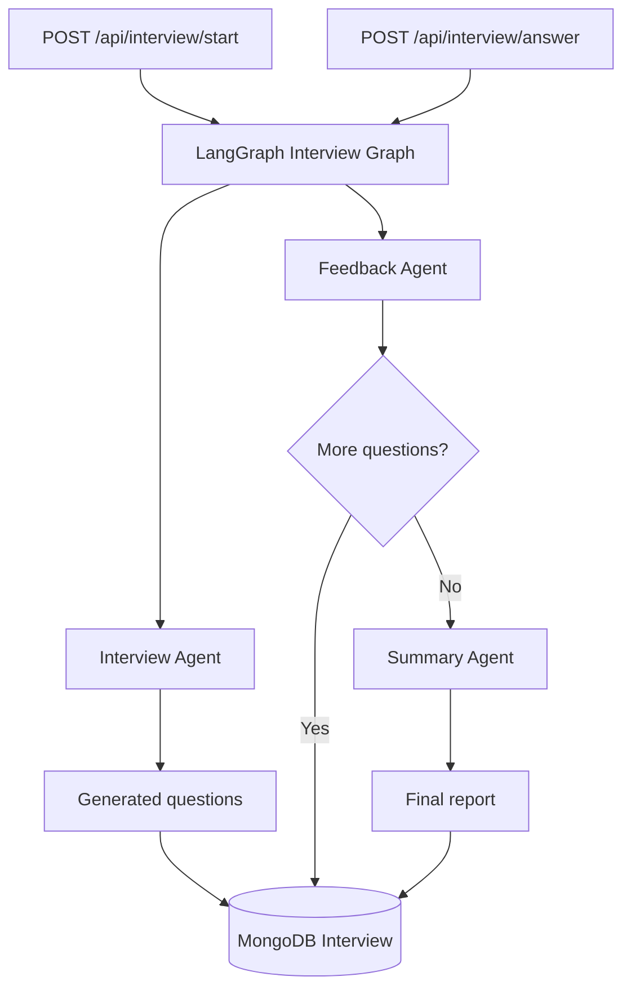
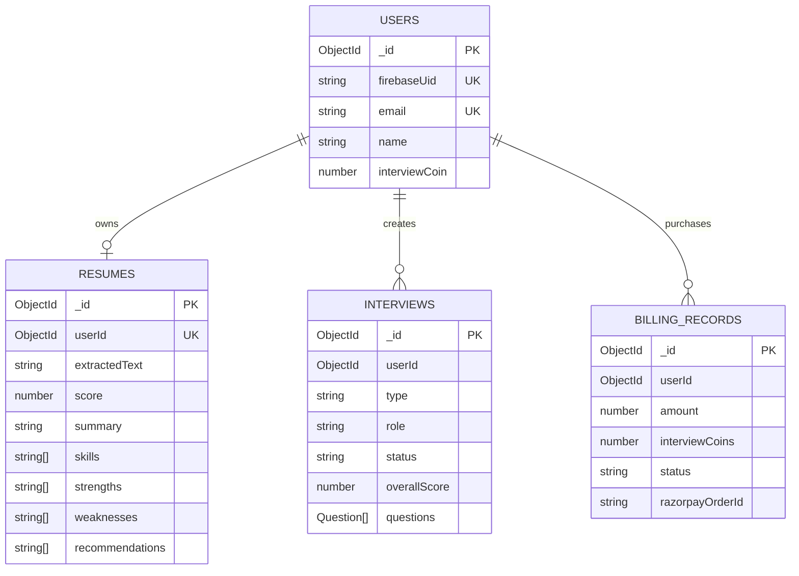
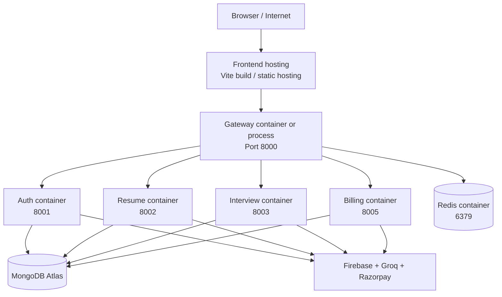

# FresherAI Architecture

## 1. One-minute explanation

FresherAI is a React-based AI interview platform backed by Node.js and Express microservices. The browser talks only to the API Gateway. The gateway validates the session stored in Redis, forwards authenticated requests to the correct service, and adds the authenticated user id to internal requests.

Authentication is handled by Firebase Authentication on the client and Firebase Admin in the Auth Service. MongoDB stores durable business data. Redis stores login sessions and short-lived service caches. Resume analysis uses PDF extraction plus a LangChain LLM agent. Interview creation, answer evaluation, and final reporting use LangGraph to route work between interview, feedback, and summary agents.

This separation keeps authentication, resume analysis, interviews, and billing independently deployable while preserving a single API entry point for the frontend.

## 2. System architecture

## 3. Request flow

### Login

### Resume analysis

### AI interview

## 4. Microservices and ownership

| Service | Port | Owns | Main APIs |
| --- | ---: | --- | --- |
| API Gateway | 8000 | CORS, cookies, session middleware, routing | `/api/auth`, `/api/me`, `/api/resume`, `/api/interview`, `/api/billing` |
| Auth Service | 8001 | Firebase token verification and user accounts | `/login`, `/logout`, `/add-coins`, `/use-coins` |
| Resume Analyzer | 8002 | PDF upload, extraction, AI analysis, resume persistence | `/upload`, `/get-resume` |
| Interview Service | 8003 | Interview lifecycle and LangGraph workflow | `/start`, `/answer`, `/:id`, `/all` |
| Billing Service | 8005 | Razorpay orders, payment verification, billing records | `/create`, `/verify` |

The Roadmap Builder was removed. It is no longer part of the active architecture.

## 5. Database architecture

The project uses database-per-service ownership. The services currently connect to separate MongoDB databases using their own `MONGODB_URL` values.

`userId` is the logical cross-service reference. Services do not use MongoDB joins; they store the user id and query their own data.

## 6. Redis architecture

Redis is shared infrastructure, not the source of truth:

- `session:{sessionId}`: authenticated user session, with expiry.
- `resume:{userId}`: cached analyzed resume.
- `interviews:{userId}`: cached interview dashboard data.
- Billing and durable user/resume/interview data remain in MongoDB.

If Redis is unavailable, authentication and cache-dependent requests fail even if MongoDB is healthy.

## 7. Deployment architecture

The repository contains separate Dockerfiles for the gateway and active services. The current `backend/docker-compose.yml` starts Redis only. In local development, the application services are started separately with `npm run dev`.

For AWS, the natural mapping is static frontend hosting, a load balancer/API Gateway in front of the gateway service, containerized services on ECS/EKS/App Runner, ElastiCache for Redis, and MongoDB Atlas. That is the deployment target shape; the repository does not currently contain a complete AWS IaC or full multi-service Compose deployment.

## 8. Interview speaking script

> The frontend never calls individual services directly. It calls an Express API Gateway, which handles CORS, cookies, authentication middleware, and routing. After Firebase authenticates the user, the Auth Service verifies the Firebase token, creates the MongoDB user if needed, and stores a temporary session in Redis.
>
> For resume analysis, the Resume Service receives a PDF, extracts text, sends it through a LangChain agent to the LLM, normalizes the structured result, stores it in MongoDB, and caches it in Redis. The Interview Service uses that analyzed resume to personalize questions.
>
> Interview generation and evaluation are modeled as a LangGraph workflow. One agent generates questions, another evaluates each answer, and the summary agent creates the final report. Interview state and results are stored in MongoDB, while Redis is used for session and dashboard caching.
>
> Billing is isolated in its own service and integrates with Razorpay. Each service owns its data and can be deployed independently, while the gateway gives the frontend one stable API boundary.

## 9. Important current limitations

- `backend/docker-compose.yml` currently starts Redis only; it does not start all application services.
- MongoDB, Firebase, Groq, and Razorpay are external dependencies configured through environment files.
- The active project uses JavaScript/JSX, not TypeScript, despite older README wording.
